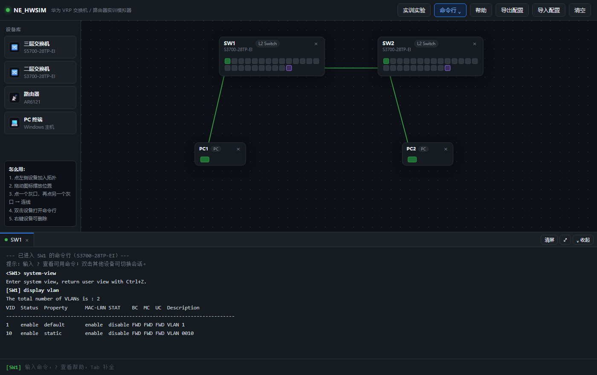

# NE_HWSIM · 华为 VRP 网络实训模拟器（单文件网页版）

**一个 HTML 文件，双击就能练华为交换机 / 路由器命令 —— 不用装 eNSP，不用装 GNS3，不联网也能用。**

> 上图就是打开后的样子：拖两台交换机、连两根线，点「实训实验」加载题目，然后在下面敲 `system-view`、`port link-type trunk` —— 和真机一个规矩。

---

## 30 秒上手

| 步骤 | 做什么 |
|---|---|
| **1** | **[点这里在线打开](https://liuyimr.github.io/NE_HWSIM/NE_HWSIM.html)**（推荐，什么都不用下） 或下载 `NE_HWSIM.html` 一个文件 |
| **2** | **双击它** —— 用 Chrome / Edge / Firefox 打开 |
| **3** | 已经自动搭好一套 VLAN 实验拓扑，点 **「开始配置」** 就能动手 |

就这三步，没有第四步。发给学生：微信、QQ、U 盘、班级群，随便怎么传都行。

> 文件必须保留 `.html` 后缀。如果微信传输后后缀变了，改回 `.html` 即可。

---

## 这是什么

给**网络课老师**和**备考华为认证的同学**做的一个练习工具。

eNSP 要装 VirtualBox，GNS3 要配镜像，虚拟机镜像动辄几个 GB，还得看电脑配置。很多学生卡在第一步就放弃了，然后就没有然后。NE_HWSIM 的判断是：**先把门槛降到零** —— 一个 230 KB 的 HTML 文件，发过去、双击、开始敲命令，整个过程不需要任何解释。

它**不是**真机的替代品，也跑不了复杂的园区网。它解决的是一个很具体的问题：**让学生能在自己的笔记本上、离线、零安装地，把 VLAN / Trunk / OSPF / ACL / NAT 这些命令反复敲到熟。**

---

## 核心特性

- **真实的华为 VRP 命令行**：用户视图 → 系统视图 → 接口视图 → VLAN 视图 → 端口组视图 → ACL 视图 → NAT 地址池视图 → OSPF 区域视图，**一级一级进入、`quit` 一级一级退出**，和真机一个规矩
- **真实的报错风格**：敲错了会出 `^` 精确指到出错的那个词，`Unrecognized` / `Incomplete` / `Ambiguous` / `Wrong parameter` 的措辞和真机一致
- **真实的交互**：`save` 会问你 `(y/n)[n]`，再问文件名 —— 跟真机一样
- **8 个现成实训实验**：拓扑一键加载，附实验目标 + 操作提示（见下表）
- **批量配端口**：`interface range ge 0/0/1 to ge 0/0/5`、`port-group group-member ... to ...`（临时端口组）、`port-group 1`（命名端口组，写进配置）三种真机写法都有
- **拖拽搭拓扑**：4 种设备随便拖，点两个端口就完成连线；线缆颜色直接反映状态（灰＝未连线，绿＝已连通，红＝shutdown，紫＝Trunk）
- **配置导入 / 导出**：导出成 txt 交给老师检查；也能再读回来。画布上没有的设备会**按型号自动新建**，导入后弹报告逐条列出哪些生效、哪些没生效、报错原文是什么
- **进度自动保存**：关掉浏览器再打开，拓扑和配置都还在
- **单文件、零依赖**：没有后端、没有账号、不联网、不采集任何数据

---

## 内置 8 个实训实验

点顶部 **「实训实验」** 按钮，选一个直接加载（会自动搭好拓扑、连好线）。

| # | 实验 | 主要练什么 | 难度 |
|---|---|---|---|
| 一 | VLAN 基础与端口划分 | `vlan` · `port link-type access` · `port default vlan` | 基础 |
| 二 | Trunk 跨交换机 VLAN | `port link-type trunk` · `port trunk allow-pass vlan` | 基础 |
| 三 | 三层交换实现 VLAN 间互通 | `interface Vlanif` · `ip address` | 基础 |
| 四 | 静态路由实现跨网段互通 | `ip route-static` | 基础 |
| 五 | OSPF 单区域动态路由 | `ospf 1` · `area 0` · `network` | 基础 |
| 六 | DHCP 自动分配地址 | `dhcp enable` · `ip pool` · `dhcp select global` | 基础 |
| 七 | **ACL 访问控制** | `acl number 3000` · `rule deny ip source ... destination ...` · `traffic-filter inbound` | 进阶 |
| 八 | **NAT 网络地址转换** | `acl number 2000` · `nat outbound` · `nat address-group` | 进阶 |

每个实验加载后都会弹出**实验目标**和**操作提示**，学生照着做即可；做完点「导出配置」把 txt 交上来。

> 实验加载的是**拓扑**（设备 + 连线），**不包含配置** —— 配置要学生自己敲，这正是练习的目的。
> 实验七预置了三个 Vlanif 网关，实验八预置了全部接口地址，让学生专注在当堂知识点上。

---

## 和 eNSP / GNS3 / Packet Tracer 比

| | **NE_HWSIM** | eNSP | GNS3 | Cisco Packet Tracer |
|---|---|---|---|---|
| 安装 | **双击 HTML，零安装** | 需装 VirtualBox + eNSP | 需装虚拟机 + 导入镜像 | 需注册 Cisco 账号 |
| 体积 | **230 KB** | 数 GB | 数 GB | 数百 MB |
| 联网 | **可完全离线** | 首次需下载镜像 | 需下载镜像 | 需登录 |
| 命令语法 | 华为 VRP | 华为 VRP | 多厂商 | Cisco IOS |
| 上手门槛 | **极低** | 中（装环境容易失败） | 高 | 中 |
| 复杂园区网 | 做不了 | 支持 | 支持 | 支持 |

一句话：**eNSP 适合做完整实验，NE_HWSIM 适合"今天就要练这几条命令"**。两者不冲突，可以配合用。

---

## 支持的命令与特性范围

**二层**：VLAN（含 `vlan batch` / `undo vlan batch`）、Access / Trunk / Hybrid 端口、MAC 地址学习表、STP / RSTP 破环、链路聚合 Eth-Trunk、端口安全 Port-Security

**三层**：直连路由、静态路由、OSPF 单区域、最长前缀匹配、ARP、Vlanif 三层接口

**服务与安全**：DHCP 服务器（地址池 / 网关）、**ACL**（基本 2000-2999 / 高级 3000-3999，支持源 + 目的 + 协议匹配，含**隐含 `deny all`**，可绑物理口、端口组或 Vlanif，入向 / 出向都生效）、**NAT**（Easy IP 与 `nat address-group` 地址池）

**`display` 系列**：`display vlan` · `display interface` · `display port vlan` · `display ip interface brief` · `display ip routing-table` · `display mac-address` · `display arp` · `display stp brief` · `display ospf peer brief` · `display ospf interface` · `display acl` · `display nat session all` · `display port-group all` · `display eth-trunk` · `display ip pool` · `display this`（任意视图可用）· `display current-configuration`

**设备型号**：S5700（三层交换机）· S3700（二层交换机）· AR6121（路由器）· PC

---

## 常见问题

**Q：要联网吗？会偷偷上传我的东西吗？**
A：不需要联网，可以完全离线运行。整个模拟器就是一个 HTML 文件，**没有任何网络请求**、没有后端、没有账号、不采集任何数据。你可以断网打开它验证。

**Q：我的配置会丢吗？**
A：会自动保存在**你自己浏览器**的本地存储里，同一台电脑、同一个浏览器再次打开会自动恢复。换电脑、换浏览器、清浏览器数据会丢。要长期保存请点「导出配置」。

**Q：和真机差多少？能替代 eNSP 吗？**
A：命令行风格、视图层级、报错措辞、`save` 交互都尽量贴近真机，但**它是教学模拟器，不是仿真平台** —— 不做报文的逐字节仿真，也不支持复杂特性（VRRP、MSTP、BGP 等）。适合练命令和验证配置思路，不适合做毕业设计级别的复杂组网；想练完整园区网请用 eNSP。

**Q：为什么设备 / 命令比真机少？**
A：刻意的。功能越少，学生越不容易被无关的东西分散注意力，文件也才能这么小。

**Q：可以拿去商用 / 印在教材里 / 发给培训班的学员吗？**
A：可以。**MIT 许可证**，随便用，商用也行，改了也不用告诉我。详见 [LICENSE](LICENSE)。

**Q：支持 Cisco 命令吗？**
A：不支持，只做华为 VRP 语法。想练 Cisco 请用 Packet Tracer。

---

## 给老师

1. 把 `NE_HWSIM.html`（或在线版链接）发到班级群。
2. 学生存到桌面，双击打开。
3. 想做哪个实验，点「实训实验」加载。
4. 学生做完点「导出配置」，把 txt 交上来 —— 每条命令配得对不对一目了然。
5. 想检查某个学生的配置：在**自己的模拟器**里点「导入配置」选中那个 txt 就能载入，直接看他配出来的网络能不能通。

> 机房不方便群发文件的话，放到校内共享盘 / 学习通 / 钉钉群文件也行，下载后双击即用。整个模拟器就一个文件，放 U 盘拷走也行。

---

## 最近更新

**v1.1.0**

- 新增两个实验：**实验七 · ACL 访问控制**、**实验八 · NAT 网络地址转换**
- 新增 **批量配端口**：`interface range` / `port-group group-member` / `port-group <名字>`
- ACL 补全：源 + 目的 + 协议匹配、**隐含 `deny all`**、`traffic-filter` 出方向、可绑 Vlanif
- 新增 **NAT**：Easy IP、`nat address-group` 地址池、`display nat session all`
- 新增 **「导入配置」**（导出的 txt 可读回，缺失设备按型号自动新建）
- 命令行面板可**展开 / 收起**（顶栏按钮、面板按钮、快捷键 `Ctrl` + 反引号键）
- PC 卡片尺寸收紧（260×97 → 126×57）；修正连线端点长期存在的 1px 偏移

**v1.0.0** —— 首个公开版本

---

## 反馈与交流

- 发现 Bug 或有建议，欢迎开 [Issue](../../issues)
- 教学场景的需求（比如想要某个特定实验、想改题目）也欢迎提出来

---

## 关于

**新易科技工作室 NewE** · 福州
作者：Liuyi · yimr@sohu.com

做工业自动控制与楼宇智能化的，这个是给网络教学做的小工具。

---

## 许可

MIT License —— 随便用，商用也行，改了也不用说。详见 [LICENSE](LICENSE)。

简单说就是：**你可以拿去发给你的学生、你的培训班、你的同事，不用问我。**

---

## 免责声明

本项目为**非官方**教学演示工具，与华为技术有限公司（Huawei Technologies Co., Ltd.）
**无任何关联**，未获得其任何形式的授权、赞助或背书。

"Huawei"、"HUAWEI"、"VRP"、"Versatile Routing Platform"、"eNSP" 等为其各自权利人的商标或注册商标。
本项目中出现这些名称，**仅用于说明模拟器所兼容 / 模仿的命令语法风格**（描述性合理使用）。

模拟器的命令回显（例如 `display version` 的输出格式）为**自行编写的模拟内容**，
不包含华为公司的任何源代码、固件、文档或二进制文件。

---

## English

**NE_HWSIM — a Huawei VRP network lab simulator that fits in one HTML file.**

A single 230 KB HTML file. Double-click it and you get a drag-and-drop network topology builder plus a
faithful Huawei VRP CLI (user view → system view → interface view → VLAN view → port-group view → ACL view
→ NAT address-pool view → OSPF area view), with authentic `^` error markers and `save` interaction.

- **No installation, no backend, no account, works fully offline** — a lightweight alternative to eNSP / GNS3
  when you just need to practise Huawei CLI commands.
- **8 built-in hands-on labs** for HCIA / HCIP practice: VLAN, Trunk, inter-VLAN routing, static routing,
  OSPF, DHCP, **ACL**, **NAT**.
- Batch port configuration (`interface range`, `port-group`), config export / import, auto-save to browser storage.
- Devices: S5700 (L3 switch), S3700 (L2 switch), AR6121 (router), PC.

**Try it online:** <https://liuyimr.github.io/NE_HWSIM/NE_HWSIM.html> ·
**Download:** [`NE_HWSIM.html`](NE_HWSIM.html) — that single file is the whole program.

Licensed under MIT. Made by [NewE](mailto:yimr@sohu.com) (Fuzhou, China).
Not affiliated with Huawei Technologies Co., Ltd. in any way.
